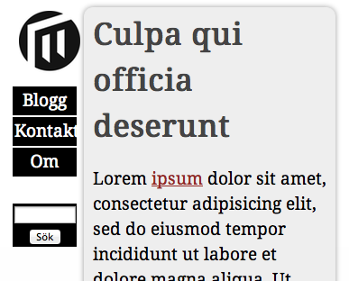
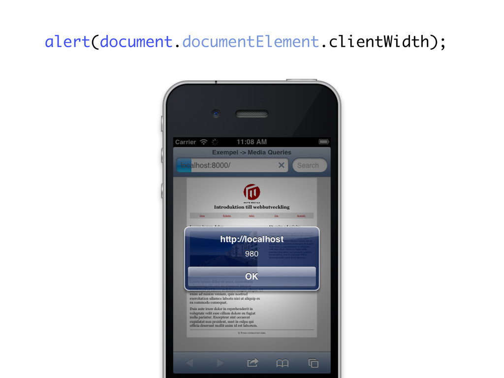

# Övning - Media Queries

CSS3 Media Queries är en viktig del och krävs för att möjliggöra något som kallas för Responsive Web Design. Denna laboration går ut på att tillämpa Media Queries för att förbättra upplevelsen av en webbplats på olika skärmstorlekar (alt. olika enheter). Det är en god idé att läsa lite om Responsive Web Design (RWD) innan ni börjar med laboration (t.ex. någon form av youtube guide eller presentation).

## Basfallet

I detta fall finns en färdig webbplats som ser OK ut i "mellanstora" webbläsare (vad gäller bredd). [Ta en titt här](../material/assets/da280a_ex_rwd_html.html).

Öppna webbplatsen och bekanta dig med den, testa också att dra ihop webbläsarfönstret för att simulera olika skärmstorlekar.

Värt att notera om webbplatsen är:

* Flexibel layout med en maxbredd på drygt 900 pixlar
* Två visuella kolumner, `header` till vänster och `#content`, `aside` och `footer` till höger
* HTML5-element används en hel del, för att öka stödet i flera webbläsare (och dess versioner) hade vi kunnat använda oss av något som kallas för [html5shiv](https://github.com/afarkas/html5shiv)
* Några bonusegenskaper från CSS3: typsnitt, tonad bakgrund, rundade hörn och skuggor

## Brytpunkt: smal skärm

Nu är det dags att börja arbeta med Media Queries. Spara ner [HTML-filen från exemplet](../material/assets/da280a_ex_rwd_html.html) och [CSS-filen från exemplet](../assets/da280a_ex_rwd_html_files/screen.css) så att du kan följa med.



Webbplatsen är inte lättläst om webbläsaren är för smal, någonstans runt 480 pixlar i bredd verkar det lämpligt att övergå från två kolumner till en. Det viktiga beslutet är hur det ska se ut istället - dvs. hur kan vi förbättra? Ska logotyp och navigation ligga överst? Samma eller ändra utseende? Eller ska innehållet vara i fokus? Du kan själv välja vilka förändringar som passar - men för enkelhetens skull används den första varianten nedan.

Vår Media Query kan se ut på följande vis (dessa placeras lämpligtvis längst ner i er CSS-fil):

``` css
@media screen and (max-width:480px) {
    /* Här placeras de CSS-regler vi vill ska
       vara aktiva när webbläsarfönstret är 
       mindre än 480 pixlar */
}
```

För att "bli av" med kolumnerna behöver vi alltså återställa egenskaperna `float` och `width` - det är dessa som ger orginal-layouten sitt utseende så om vi återställer dessa åstadkommer vi det vi vill. Tänk på att följande placeras i ovanstående `@media`-block (inom `{ ... }`):

``` css
header, #content, aside, footer {
    float: none;
    width: 100%;
    margin: 0;
}

header {
    margin-bottom: 2em;
}
```

Experimentera med ovan - pröva att dra ihop webbläsarfönstret, lägg gärna till fler ändringar och se vad som händer (och vad du tycker passar).

## Rätt storlek för visningsytan

Som bekant så kan mobila enheter använda en annan storlek på visningsytan än den faktiska skärmen. En iPhone kan exempelvis utgå från 980 pixlar.



Vi behöver ange att vi istället föredrar en icke-skalad visningsyta (eng. viewport). Detta görs enkelt som meta-data i `<head>`:

``` html
<meta name="viewport" content="width=device-width, initial-scale=1.0">
```

## Brytpunkt: bred skärm

Över 920 pixlar händer det inte så mycket - vi ser bara mer av bakgrunden. Istället vorde det bra om den extra ytan utnyttjades. En variant är att lägga till en tredje kolumn i form av det som nu ligger under artiklarna (i `<aside>`). Informerllt kan förändringarna sammanfattas som:

* Se till att vi har en bredd nog i `#container`
* Se till att de tre kolumnerna får plats brevid varandra (`header`, `#content` och `aside`)
* `float`

Ett förslag på kodförändringar (ändra gärna!):

``` css
@media screen and (min-width: 1100px) {
    #container {
        max-width: 1600px;
    }

    header {
        width: 15%;
    }

    #content {
        width: 60%;
        margin-right: 2%;
        float: left;
    }

    aside {
        width: 21%;
        float: left;
        clear: none;
    }

    aside div {
        float: none;
        width: 100%;
        margin: 0 0 1.5em;
    }
}
```

Hur ser det ut när ditt webbläsarfönster är brett?

## Vad mer?

Efter att vi börjat experimentera med brytpunkter kanske vi kan vill ta steget att lägga till fler, eller kanske kontrollera hur det ser ut i andra webbläsare? Det finns många saker som kan göras bättre, varför inte göra användartester? Hur mycket vill vi att det ska skilja sig på en stationär dator och en mobil? Många av dessa frågor och problem är något som blir en iterativ process där vi prövar något och testar för att sedan eventuellt ändra något.

## Vidare laboration

Försök att använda en redan befintlig layout från en tidigare laboration - mobilanpassa denna efter eget tycke och smak. Tänk på att du vill öka användbarheten och tillgängligheten. Vad tror du om att utgå från att anpassa en sida från början i jämförelse med att göra det i efterhand - bra/dåligt?
